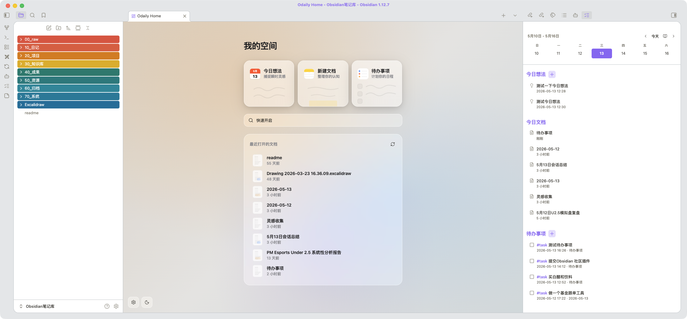

# Odaily Home

[中文](README.zh-CN.md)

A Liquid Glass daily dashboard for Obsidian. Replace empty new tabs with a beautiful action center, plus a sidebar for calendar navigation, daily memos, and task management.

## Features

### Home View (New Tab Page)
- **Quick Note** — opens today's daily note in one click
- **New Document** — creates an untitled document in `00_raw/`
- **Todo List** — add tasks to your daily note or a dedicated file
- **Quick Switcher** — `Cmd/Ctrl+O` style search from the home screen
- **Recent Files** — shows recently opened or modified notes
- **Custom Backgrounds** — set per-theme (light/dark) backgrounds from vault images, URLs, or CSS gradients
- **Theme Toggle** — switch between light and dark mode from the home screen

### Sidebar (Overview Panel)
- **Calendar Week/Month View** — navigate by day, week, or month with a date picker
- **Daily Memos** — capture `#memo` tagged thoughts with timestamps
- **Today's Documents** — see files modified today (or selected date)
- **Task Management** — view and complete open tasks with 1-second undo confirmation
- **Completed Tasks** — see what was finished today with completion timestamps
- **Tag Filtering** — filter tasks by custom tags (e.g., `#todo`, `#待办`)

## Commands
- `Open Odaily home` — open the home view in a new tab
- `Open Odaily sidebar` — open the overview panel in the right sidebar
- `Odaily: add memo` — capture a quick thought to your daily note
- `Odaily: add todo` — add a task to your configured target file

## Settings
- **Light/Dark Background**: Set custom backgrounds using vault image paths, external URLs, CSS colors, or CSS gradients. Light and dark themes are configured independently.
- **Task Tags**: Filter the sidebar task list to show only tasks matching specific tags.
- **Todo File**: Choose where new tasks are saved (leave empty to use daily notes).
- **Todo Position**: Append new tasks to the top or bottom of the target file.

## Screenshots



## Installation

### From Community Plugins
1. Open Obsidian Settings > Community Plugins
2. Disable Safe Mode if needed
3. Click Browse and search for "Odaily Home"
4. Install and enable

### Manual Installation
1. Download the latest `main.js`, `manifest.json`, and `styles.css` from [GitHub Releases](https://github.com/guchang/Odaily/releases)
2. Copy them into `<vault>/.obsidian/plugins/odaily-home/`
3. Restart Obsidian or reload plugins
4. Enable the plugin in Settings > Community Plugins

### BRAT (Beta)
1. Install the [BRAT](https://github.com/TfTHacker/obsidian42-brat) plugin
2. Add `guchang/Odaily` as a beta plugin
3. BRAT will keep the plugin updated automatically

## Development

```bash
git clone https://github.com/guchang/Odaily.git
cd Odaily
npm install
npm run dev    # watch mode
npm run build  # production build
```

For local testing, symlink the plugin folder:

```bash
ln -s $(pwd) "<vault>/.obsidian/plugins/odaily-home"
```

## License

MIT. See [LICENSE](LICENSE) for details.
